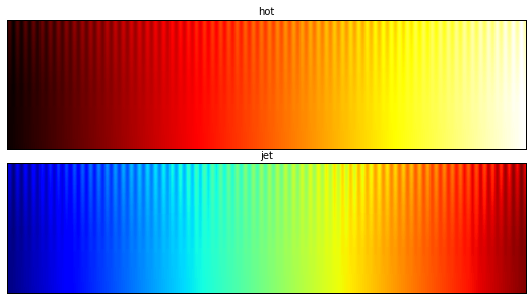
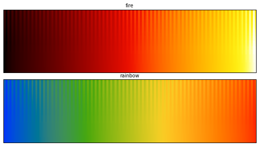

colorcet
--------

[colorcet](https://github.com/bokeh/colorcet) is a collection of
perceptually uniform colormaps for use with Python plotting programs like
[bokeh](http://bokeh.pydata.org),
[matplotlib](http://matplotlib.org),
[holoviews](http://holoviews.org), and
[datashader](https://github.com/bokeh/datashader).

Most colormaps provided for use in Python programs are highly
perceptually nonuniform, which means that small changes in data values
result in large changes in the perceptual appearance of the
corresponding colors, or vice versa.  For instance, the matplotlib
"hot" and "jet" colormaps have long stretches where the apparent
colors change imperceptively, such as the yellow region in "hot" and
the cyan/green region in "jet":



When colormaps are used for visualizing scientific datasets, these
perceptual nonlinearities can make interpretation of this data very
difficult, because false boundaries appear in the data, and genuine
boundaries and changes can be obscured.

To combat these issues, Peter Kovesi at the Center for Exploration
Targeting created a set of colormaps that are sampled uniformly in a
perceptual color space, using methods he describes in a [paper on
arXiv](https://arxiv.org/abs/1509.03700).  For instance, the
perceptually uniform versions of the above colormaps are called "fire"
and "rainbow" in this package:



Peter provides [versions of 50 colormaps for a variety of different
plotting programs](http://peterkovesi.com/projects/colourmaps), and
this package provides those colormaps ready to use from within Python
programs.  The colormaps are all illustrated in an [example
notebook](doc/index.html) that describes the different types available
and allows you to test how perceptually uniform they are on your
particular display device.


## Installation

colorcet is available on most platforms using the `conda` package manager,
from the `bokeh` channel:

```
conda install -c bokeh colorcet
```

or by using pip:

```
pip install colorcet
```

Alternatively, you can manually install from the repository if you
wish to be able to modify the code over time:

```
git clone https://github.com/bokeh/colorcet.git
cd colorcet
python setup.py develop
```

## Learning more

You see more perceptually uniform colormaps and learn more about them
in [Peter Kovesi's 2015 arXiv paper](https://arxiv.org/pdf/1509.03700v1.pdf),
and at the [matplotlib site](https://bids.github.io/colormap/),
the [cmocean site](http://matplotlib.org/cmocean/), and a 
[1996 paper from IBM](http://www.research.ibm.com/people/l/lloydt/color/color.HTM).
